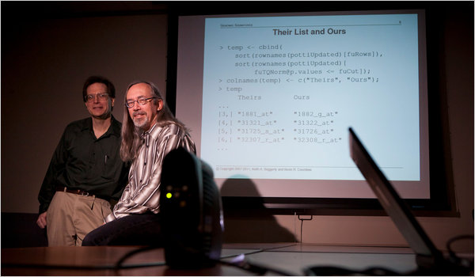
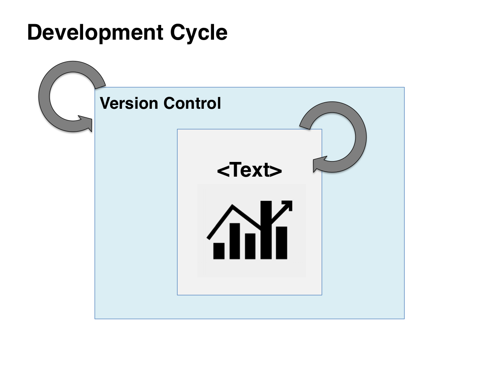
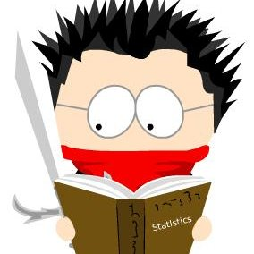
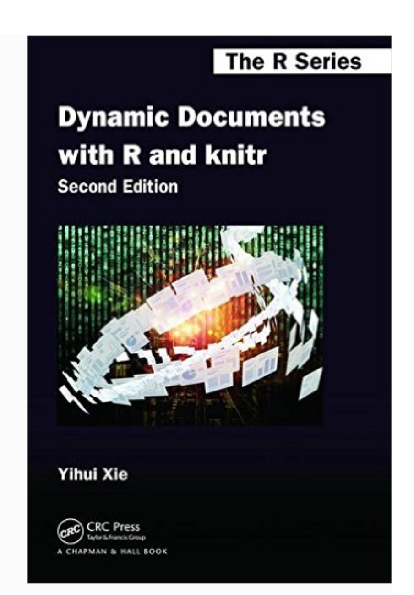

## Reproducibility

> * Reproducibile research is research that can be independently replicated

> * Traditionally, researchers have separated data analysis and the documentation describing the analysis and its findings

> * This makes updating work inefficient and reproducibility difficult or even impossible

> * Aiming for _reproducibility_ gives you _reusability_ for free

--- 

## Heroes of Reproducible Research

<div style='text-align: center;'>
    
</div>

<br>

"Keith Baggerly, left, and Kevin Coombes, statisticians at M. D. Anderson Cancer Center, [found flaws in research on tumors](http://www.nytimes.com/2011/07/08/health/research/08genes.html?_r=0)." Credit: Michael Stravato for The New York Times

---

<div style='text-align: center;'>
    
</div>

> The goal of this talk is to introduce several tools in R that help to make the practice of the development cycle easy.

---

## Getting Started

1. Get [RStudio](https://www.rstudio.com)

2. Install knitr and rmarkdown packages

3. Get git

---

## RStudio

> * [RStudio](https://www.rstudio.com) is a free integrated development environment for R

> * Available for all major platforms

> * The IDE provides a windowing system to help organize the workspace

> * There are [built-in tools](https://www.rstudio.com/products/rstudio/features/) for directed code execution, syntax highlighting, and debugging

> * There is a GUI for many common tasks including the creation and processing of reproducible reports


---

## R Markdown

> - Dynamic documents in R start with an R Markdown file

> - Markdown is a markup language with minimal syntax

> - Executable code is embedded with code chunks 

> - 

<pre>
```{r OPTIONS}
  CODE HERE
```
</pre>

> - The knit function of knitr is used to produce a file with text, code, and results of code

--- &twocol

## The knitr Package


*** =left 

*  Author R Ninja, Yihui Xe

* Provides tools for creating dynamic documents

* Use to weave text and code in multiple languages

* Multiple input formats: Rnw, Markdown, HTML, LaTeX

* Multiple output formats: pdf, Word, HTML
  
* RStudio's default engine for weaving dynamic documents is [knitr](http://yihui.name/knitr/demo/rstudio/)

*** =right

<div style='text-align: center;'>
    
</div>

---


