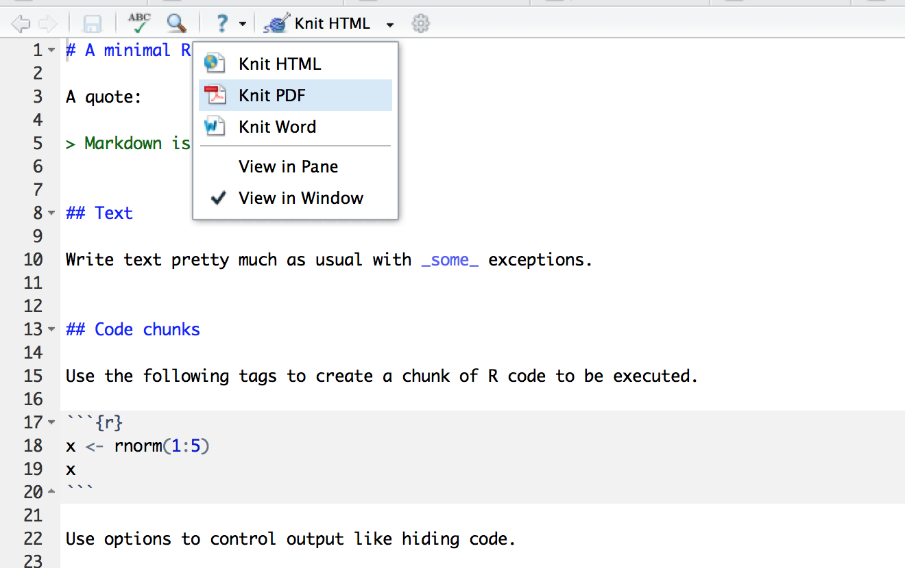
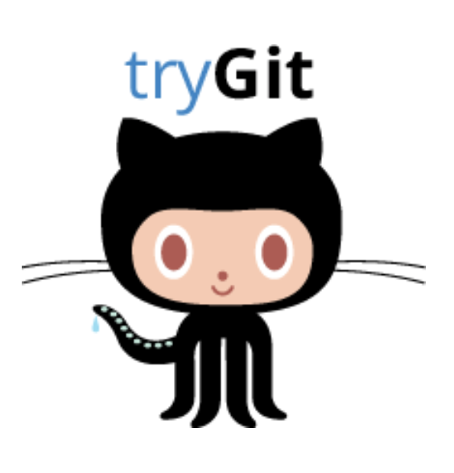
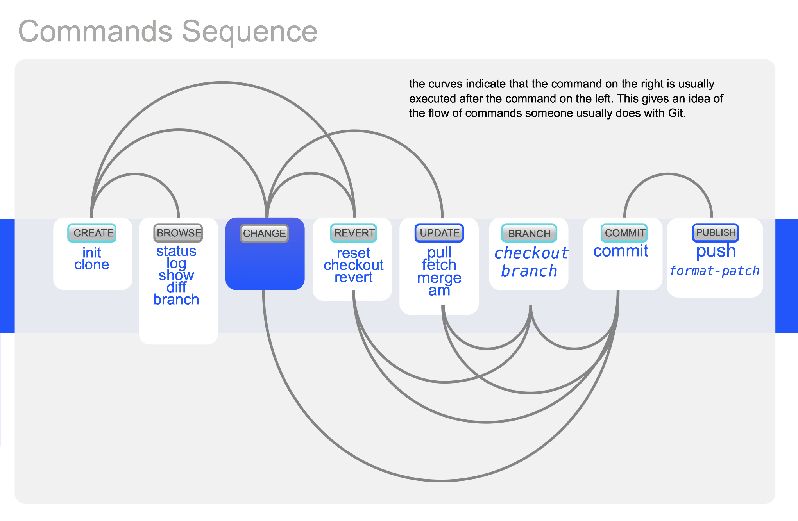
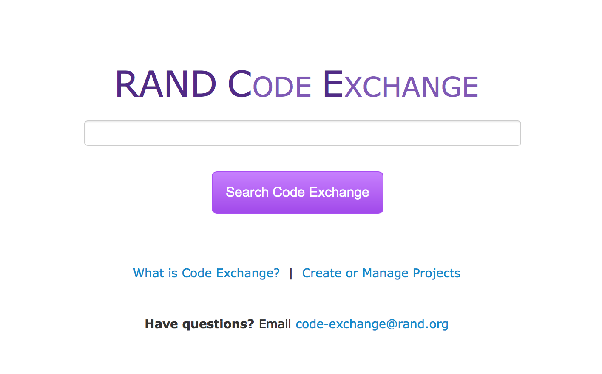

<div style='text-align: center;'>
    
</div>

> The goal of this talk is to introduce several tools in R that help to make the practice of the development cycle easy.

---

## Getting Started

1. Get [RStudio](https://www.rstudio.com)

2. Install `knitr` and `rmarkdown` packages

3. Get Git

---

## RStudio

> * [RStudio](https://www.rstudio.com) is a free integrated development environment for R

> * Available for all major platforms

> * The IDE provides a windowing system to help organize the workspace

> * There are [built-in tools](https://www.rstudio.com/products/rstudio/features/) for directed code execution, syntax highlighting, and debugging

> * There is a GUI for many common tasks including the creation and processing of reproducible reports


---

## R Markdown

> - Dynamic documents in R start with an R Markdown file

> - Markdown is a markup language with minimal syntax
    - Easier than LaTeX
    - Recognized by many rendering tools
    - NOT exclusive to R
    
> - R Markdown builds on markdown syntax but adds the ability to embed executable R code inline or as code chunks

> - The `knit` function of knitr is used to produce a file with text, code, and results of code


--- 

## R Markdown Resources

<br>

* [Cheat sheet](https://www.rstudio.com/wp-content/uploads/2015/02/rmarkdown-cheatsheet.pdf) - Workflow steps and basic features

* [Reference](https://www.rstudio.com/wp-content/uploads/2015/03/rmarkdown-reference.pdf) - Details on syntax and chunk options

---

## Minimal Example: R Markdown

<br>

File available on [github](https://github.com/skoval/Reproducibility/blob/master/examples/minimal_markdown.Rmd)

--- &twocol .small

## The knitr Package


*** =left 

*  Author and R Ninja, Yihui Xie

* Provides tools for creating dynamic documents

* Use to weave text and code in multiple languages

* Multiple input formats: Rnw, Markdown, HTML, LaTeX

* Multiple output formats: pdf, Word, HTML
  
* RStudio's default engine for weaving dynamic documents is [knitr](http://yihui.name/knitr/demo/rstudio/)

*** =right

<div style='text-align: center;'>
    
</div>

---

## Knit in Console or RStudio?

You can knit R Markdown files manually with `knit` or with RStudio's GUI. In other words, the following are equivalent:

```{r eval = FALSE}
knit("minimal_example.Rmd")
```

<br>

<div style='text-align: center;'>
    
</div>

---

## Knit in Console or RStudio?

> * If you want to use input other than R Markdown, you will want to use `knit` directly (i.e. on the command line).

> * The advantage of `knitr` is that it provides more control and flexibility in document inputs

> * This is often needed for creating publication-ready reports

---

## Minimal Example: R Latex


File available on [github](https://github.com/skoval/Reproducibility/blob/master/examples/minimal_markdown.Rtex)


---

## Version Control


> * _Version control_ describes the process of tracking the history of a project's development so that developers can easily see changes made and revert to earlier versions

> * Git is the most popular version control tool

> * [Github](https://github.com) is a cloud service for sharing and collaborating on projects using Git 

> *  

---

## Git Cheat Sheet


<div style='text-align: center;'>
    
</div>

Source: [http://git.or.cz/](http://www.cheat-sheets.org/saved-copy/git-cheat-sheet.pdf)

--- .small


## Getting Started

* You can work with [git](http://git-scm.com) on the command line

* Or, use a GUI for [Windows](https://windows.github.com) or [Mac](https://mac.github.com)

|Term| What it Means |
|:--------:|:--------:|
|repo| The "project", i.e. directory where Git project resides|
|commit| Saving changes to version history (NOT the same as saving files)|
|origin|Alias usually given to remote repo|
|master|Alias usually given to local repo|

<br>

|Command | What it Does |
|:--------:|:--------:|
|git init | Start a repo|
|git add | Add files to repo|
|git commit -m|Commit changes to history and add message|
|git push origin master|Push commits to remote alias|

--- .small

## RAND Code Exchange

<div style='text-align: center;'>
    
</div>

> * RAND's firewall prevents interacting with remote repos on GitHub 

> * This is a barrier when collaborating on projects with external researchers

> * However, for internal projects, RAND's [Code Exchange](code-exchange.rand.org) is a service much like GitHub but more secure 

--- .small


## Slidify

> * The great thing about learning and using markdown is that more and more interactive tools are using it

> * One awesome example of this is [slidify](http://slidify.org)

> * Slidify is a package by Ramnath Vaidyanathan that uses markdown-like documents to create HTML5 presentations

> * If you can write markdown, you can get started with slidify pretty quickly

> * This presentation is an [example](https://github.com/skoval/Reproducibility/blob/master/index.Rmd)

> * RStudio's presentations are another option


---

## Reference Material

<br>

* [Slide deck](http://skoval.github.io/Reproducibility/)

* [Source on github](https://github.com/skoval/Reproducibility/)
